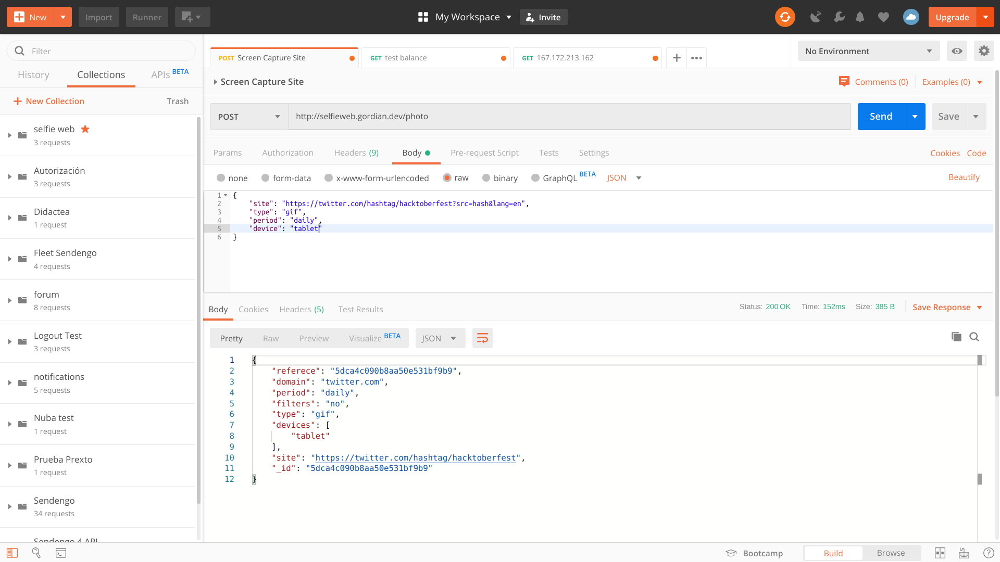
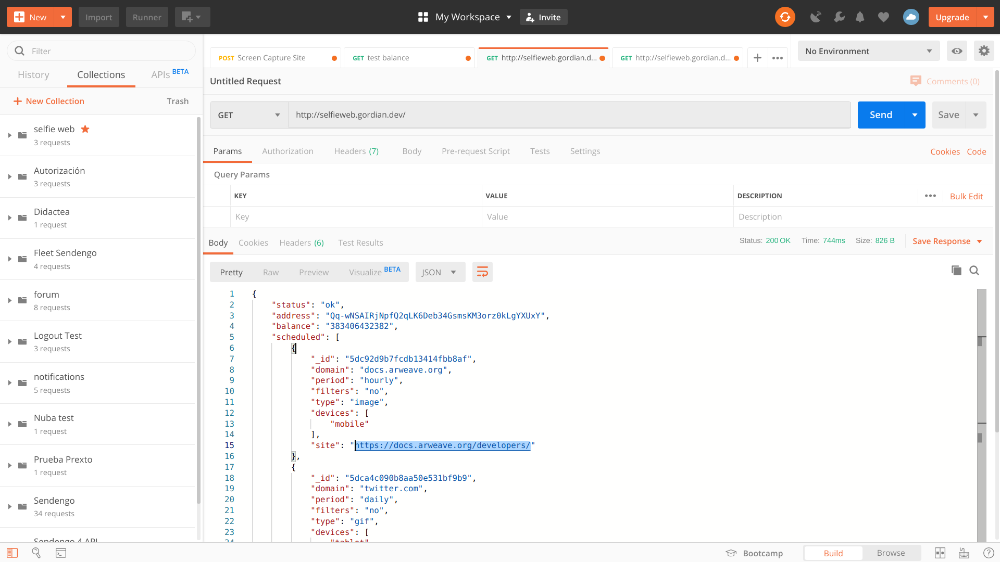

# Selfie Web

Images, Gif and maybe more to build the next memory machine.

Account is associated to the test bot: https://viewblock.io/arweave/address/Qq-wNSAIRjNpfQ2qLK6Deb34GsmsKM3orz0kLgYXUxY 


## Motivation

Humans are visual creatures, 'in the brain itself, neurons devoted to visual processing number in the hundreds of millions and take up about 30 % of the cortex, as compared with 8 % for touch and just 3 % for hearing'. Also 'Humans have a remarkable ability to remember pictures'. That's we need tiny bites of the web through images, gif, and so one to show to the next generations where we spended to much time, see how the web has been progress and get nostalgia in a couple of year.

## Status
- [X] Register sites with minimal configuration to take screenshot and gif periodically
- [X] Perform capture of images and gif if the site and submit a tx to arweave 
- [X] List of sites registered and balance of the wallet used by the bot


## Install dependencies

```
yarn install
```

The project stores info about the sites and its configuration as well as the status of jobs. So we need to up mongo as following:
```
docker run -d -p 127.0.0.1:27017:27017 --name mongo mongo
```

## Run the server
Before start the bot ensure you have enough funds to save images and gifs to the permaweb!
```
node start main.js -w wallet.json -p 80 -H 0.0.0.0
```

## Funtionality
Send to http://host/photo a payload to register sites:
```
{
  "site": "https://fullurl.com/also_allow_paths",
  "type": "image", // This also could be a gif
  "period": 'daily', // hourly, weekly, monthly, quartes, yearly
  "device": 'desktop' // mobile, tablet
}
```


The bot will store this info to its database and make screendshots and some timelapses(GIF) periodically at the indicated it period !

You can check all registered tasks at the root http://host/


And see what transactions are sended correctly to http://host/jobs

In a future let's build some integrations to show your web art to the world!


# Next Steps
- Replace scheduler
- Management of task and its confirmations
- include filters like instagram, emojis and text to add the image
- Allow diff detection to only upload when a mid-to-big change has happened
- Allow pesudo scripts to intectact with the site, and grab such thing
- Allow more than one resolution per domain
- Update or delete current registered sites

## Opportunities to improve
- The scheduler is too rough, doesn't allow change or update the task easily. So it could be a chance to replace node-cron, in favor another task scheduler.
- If 2+ tx are fired at the same time, only one is commited to the blockchain, we can improve this with many accounts or wait until one is confirmed and resubmit the others and so on.


## License
See [LICENSE](/LICENSE)
